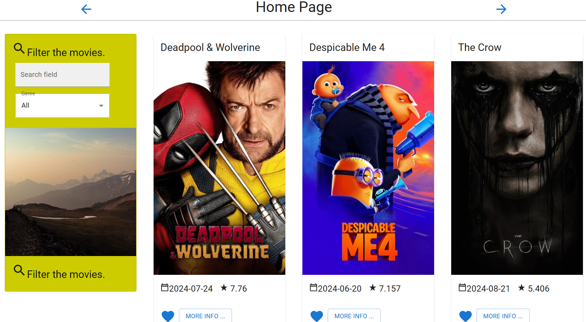

# React - Movie Database Site



React Movie Labs is a movie application built using React, which allows users to view, filter, and explore movies using live data from The Movie Database (TMDB) API.

## Table of Contents
1. [Overview](#overview)
2. [Features](#features)
3. [Getting Started](#getting-started)
4. [API Integration](#api-integration)
5. [Components](#components)
6. [Filtering Movies](#filtering-movies)
7. [Running the App](#running-the-app)
8. [Future Improvements](#future-improvements)

## Overview

This project aims to provide a simple and clean interface for browsing movies. It uses live data from the TMDB API, which is displayed using various React components. The app also allows filtering based on movie genres, helping users find exactly what they’re looking for.

## Features

- Display a list of movies fetched from the TMDB API.
- Movie Card component to showcase individual movie details.
- Filter movies based on genre.
- Clean and responsive UI.
- Utilizes React hooks (`useState`, `useEffect`) for managing state and fetching data.

## Getting Started

### Prerequisites

To get the app up and running, ensure you have the following installed:

- Node.js (version >= 14.x)
- NPM or Yarn

### Installation

1. Clone the repository:

    ```bash
    git clone https://github.com/JacobDicksonOfficial/react-movie-labs.git
    cd react-movie-labs
    ```

2. Install dependencies:

    ```bash
    npm install
    ```

3. Get an API key from [TMDB](https://www.themoviedb.org/documentation/api), and create a `.env` file with your key:

    ```bash
    REACT_APP_TMDB_API_KEY=your_api_key_here
    ```

4. Start the app:

    ```bash
    npm start
    ```

The app will be running at `http://localhost:3000`.

## API Integration

This project utilizes The Movie Database (TMDB) API to fetch live movie data. All API requests are handled using `fetch` within React’s `useEffect` hook.

Example API request:

```js
const fetchMovies = async () => {
    const response = await fetch(`https://api.themoviedb.org/3/movie/popular?api_key=${process.env.REACT_APP_TMDB_API_KEY}`);
    const data = await response.json();
    setMovies(data.results);
};
